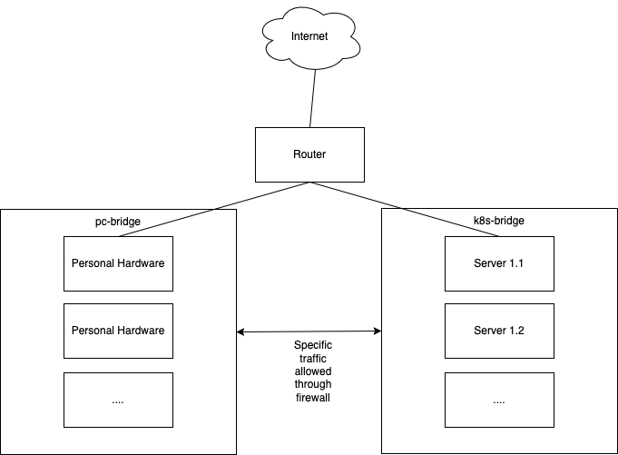
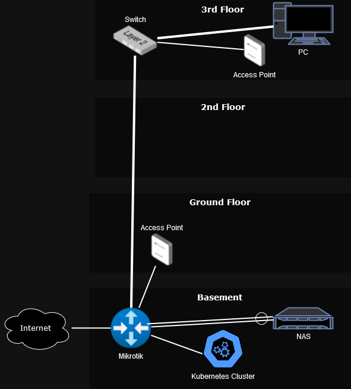

# Self Hosting

# Table of Contents

- [Self Hosting](#self-hosting)
- [Table of Contents](#table-of-contents)
- [Introduction](#introduction)
- [Hardware](#hardware)
- [Network Setup](#network-setup)
  - [Logical network diagram](#logical-network-diagram)
  - [Firewall rules](#firewall-rules)
  - [Steps to setup the configuration](#steps-to-setup-the-configuration)
- [Kubernetes](#kubernetes)
  - [Kubernetes Node Setup](#kubernetes-node-setup)
  - [Kubernetes Components](#kubernetes-components)
- [Additional Thoughts](#additional-thoughts)
  - [Make wireguard great again](#make-wireguard-great-again)
  - [Cluster Setup](#cluster-setup)
    - [Control Plane](#control-plane)
    - [Worker Nodes](#worker-nodes)
  - [ArgoCD](#argocd)
    - [Configure Argo to snyc apps](#configure-argo-to-snyc-apps)
  - [DNS](#dns)
  - [Kubeseal](#kubeseal)
  - [Image registry on the NAS? In the cluster? Dockerhub?](#image-registry-on-the-nas-in-the-cluster-dockerhub)
  - [Cloudflare](#cloudflare)
  - [Use cilium to protect network further](#use-cilium-to-protect-network-further)
  - [Gateway API](#gateway-api)
  - [PXE Boot](#pxe-boot)
  - [Torrent](#torrent)
- [Physical Network](#physical-network)
  - [New hardware](#new-hardware)

# Introduction

 <!-- Adjust width as needed -->

In order to host services I need, I'm using the here described setup.
This is a living document so far and should only be seen as collection of my ideas 😁

# Hardware

| What    | Model                       | Description                                                       |
| ------- | --------------------------- | ----------------------------------------------------------------- |
| Router  | Mikrotik RB4011iGS+         | Latest firmware, central network switch and router for the setup  |
| Servers | 3x Lenovo ThinkCentre M710s | Intel Core i7-7700 <br />64 GB Memory                             |
| Servers | HP Proliant D20 G9          |                                                   |

# Network Setup

In order to separate the internal personal LAN from the cluster, a new VLAN is created.

The Kubernetes nodes are connected via the physical ports on the router.

| Interface    | Connected | VLAN | Bridge          |
| ------------ | --------- | ---- | --------------- |
| Interface 1  | Personal  | 10   | pc-bridge       |
| Interface 2  | Personal  | 10   | pc-bridge       |
| Interface 3  | Personal  | 10   | pc-bridge       |
| Interface 4  | Personal  | 10   | pc-bridge       |
| Interface 5  | Personal  | 10   | pc-bridge       |
| Interface 6  | Personal  | 10   | pc-bridge       |
| Interface 7  | Cluster   | 10   | k8s-bridge      |
| Interface 8  | Cluster   | 20   | k8s-bridge      |
| Interface 9  | Cluster   | 20   | k8s-bridge      |
| Interface 10 | Personal   | 20  | pc-bridge (PoE) |

## Logical network diagram



## Firewall rules

| Chain   | Source | Destination | Port        | Protocol | Action     | Description                |
| ------- | ------ | ----------- | ----------- | -------- | ---------- | -------------------------- |
| forward | VLAN10 | VLAN20      | 8006        | TCP      | accept     | Proxmox interface          |
| forward | VLAN10 | VLAN20      | 22          | TCP      | accept     | SSH access to nodes        |
| forward | VLAN10 | VLAN20      | 6443        | TCP      | accept     | API Server                 |
| forward | VLAN10 | VLAN20      | 30000-32767 | TCP      | accept     | Access to exposed services |
| forward | VLAN20 | VLAN10      | 2049        | TCP/UDP  | accept     | NFS4 access for CSI driver |
| srcnat  | VLAN10 | WAN         | -           | -        | masquerade | NAT for internet access    |
| srcnat  | VLAN20 | WAN         | -           | -        | masquerade | NAT for internet access    |

## Steps to setup the configuration
```bash
## bridges connect the required ports, so no VLAN tagging occurs
/interface bridge
add name=pc-bridge
add name=k8s-bridge

/interface/list/member
add list=LAN interface=pc-bridge
add list=LAN interface=k8s-bridge

# give the attached clients IPs using DHCP
/ip address
add address=192.168.10.1/24 interface=pc-bridge
add address=10.13.37.1/24 interface=k8s-bridge

/ip pool
add name=pool10 ranges=192.168.10.10-192.168.10.100
add name=pool20 ranges=10.13.37.10-10.13.37.100

/ip dhcp-server
add name=dhcp10 interface=pc-bridge address-pool=pool10 disabled=no
add name=dhcp20 interface=k8s-bridge address-pool=pool20 disabled=no

/ip dhcp-server network
add address=192.168.10.0/24 gateway=192.168.10.1 
add address=10.13.37.0/24 gateway=10.13.37.1 

/ip firewall address-list
add address=192.168.10.0/24 list=pc-bridge-list
add address=10.13.37.0/24 list=k8s-bridge-list
add address=192.168.10.10-192.168.10.100 list=allow-to-router

## setup firewall rules
/ip firewall filter
add action=accept chain=forward comment="Proxmod Admin Interface Access" dst-address-list=k8s-bridge-list dst-port=8006 protocol=tcp src-address-list=pc-bridge-list
add action=accept chain=forward comment="SSH access to k8s" connection-state="" dst-address-list=k8s-bridge-list dst-port=22 protocol=tcp src-address-list=pc-bridge-list
add action=accept chain=forward comment="k89s api access" dst-address-list=k8s-bridge-list dst-port=6443 protocol=tcp src-address-list=pc-bridge-list
add action=accept chain=forward comment="k8s svc access" dst-address-list=k8s-bridge-list dst-port=30000-32767 protocol=tcp src-address-list=pc-bridge-list
add action=accept chain=forward comment="connection to ingress http" dst-address-list=k8s-bridge-list dst-port=80 protocol=tcp src-address-list=pc-bridge-list
add action=accept chain=forward comment="connection to ingress https" dst-address-list=k8s-bridge-list dst-port=443 protocol=tcp src-address-list=pc-bridge-list
add action=accept chain=forward comment="k8s to syno NFSv4" dst-address-list=pc-bridge-list dst-port=2049 protocol=tcp src-address-list=k8s-bridge-list
add action=accept chain=forward comment="allow established connections" connection-state=established,related dst-address-list=k8s-bridge-list src-address-list=pc-bridge-list
add action=accept chain=forward comment="allow established connections" connection-state=established,related dst-address-list=pc-bridge-list src-address-list=k8s-bridge-list
add action=drop chain=forward disabled=yes in-interface=pc-bridge log=yes log-prefix=DROP-BRIDGE out-interface=bridge
add action=drop chain=forward disabled=yes in-interface=k8s-bridge out-interface=bridge
add action=drop chain=forward comment="drop the rest" dst-address-list=k8s-bridge-list src-address-list=pc-brige-list
add action=drop chain=forward comment="drop the rest" dst-address-list=pc-brige-list log=yes log-prefix=DROP-K8S-TO-PC src-address-list=k8s-bridge-list


## map the ports to the actual bridges
/interface bridge port
set [find interface=ether1] bridge=pc-bridge
set [find interface=ether2] bridge=pc-bridge
set [find interface=ether3] bridge=pc-bridge
set [find interface=ether4] bridge=pc-bridge
set [find interface=ether5] bridge=pc-bridge
set [find interface=ether6] bridge=pc-bridge
set [find interface=ether7] bridge=k8s-bridge
set [find interface=ether8] bridge=k8s-bridge
set [find interface=ether9] bridge=k8s-bridge
set [find interface=ether10] bridge=k8s-bridge
```

# Kubernetes

## Kubernetes Node Setup

| Server | VM  | Node          |
| ------ | --- | ------------- |
| PC1    | VM1 | Master Node 1 |
| PC1    | VM2 | Worker Node 1 |
| PC1    | VM3 | Master Node 2 |
| PC1    | VM4 | Worker Node 2 |
| PC1    | VM5 | Master Node 3 |
| PC1    | VM6 | Worker Node 3 |

## Kubernetes Components

| What    | Service     | Description |
| ------- | ----------- | ----------- |
| Ingress | using nginx |             |
| Metrics | Grafana & Prometheus |   |
| Security validation | kube-bench |  |
| Admin | kubernetes dashboard | | 

# Additional Thoughts

## Make wireguard great again

```bash
/interface wireguard
add name=wireguard0 listen-port=13337 private-key="HIDDEN_DATA"

/ip address
add address=192.168.99.1/24 interface=wireguard0

/interface wireguard peers
add public-key="peerPublicKey" allowed-address=192.168.99.2/32 interface=wireguard0

/ip route
add dst-address=192.168.10.0/24 gateway=192.168.99.1
add dst-address=10.13.37.0/24 gateway=192.168.99.1

/ip firewall filter
add action=accept chain=input comment="allow wireguard" dst-port=13231 log-prefix=allow-wireguard protocol=udp
add action=accept chain=input comment="wireguard traffic" in-interface=wireguard1 log-prefix=allow-wireguard-traffic protocol=udp
add action=accept chain=forward comment="router to wireguard" dst-address=192.168.100.0/24 log-prefix=router-to-wireguard src-address=192.168.10.0/24
add action=accept chain=forward comment="wireguard to router" dst-address=192.168.10.0/24 log-prefix=wireguard-to-router src-address=192.168.100.0/24
add action=accept chain=forward comment="k8s to wirguard" dst-address=192.168.100.0/24 src-address=10.13.37.0/24
add action=accept chain=forward comment="wireguard to k8s" dst-address=10.13.37.0/24 src-address=192.168.100.0/24

/ip firewall nat
add action=masquerade chain=srcnat out-interface=wireguard0
```

## Cluster Setup

### Control Plane
```bash
export CONTROL_PLANE_IP=10.13.37.15  # IP of the first node
export TALOSCONFIG=./talosconfig # Use local talos config file

talosctl gen config fauli-cluster https://${CONTROL_PLANE_IP}:6443
talosctl apply-config --insecure --nodes $CONTROL_PLANE_IP --file controlplane.yaml
talosctl bootstrap --nodes $CONTROL_PLANE_IP --endpoints $CONTROL_PLANE_IP   # This is only needed once

talosctl logs -n $CONTROL_PLANE_IP -e $CONTROL_PLANE_IP kubelet

talosctl apply-config --insecure --nodes 10.13.37.25 --file controlplane.yaml
talosctl apply-config --insecure --nodes 10.13.37.35 --file controlplane.yaml

k get nodes
#NAME            STATUS   ROLES           AGE   VERSION
#talos-31u-8a4   Ready    control-plane   15m   v1.30.1
#talos-5nh-9w5   Ready    control-plane   32m   v1.30.1
#talos-l04-n03   Ready    control-plane   17m   v1.30.1
```

### Worker Nodes
```bash
talosctl apply-config --insecure --nodes 10.13.37.36 --file worker.yaml
talosctl apply-config --insecure --nodes 10.13.37.36 --file worker.yaml
talosctl apply-config --insecure --nodes 10.13.37.36 --file worker.yaml

k get nodes
#NAME            STATUS   ROLES           AGE   VERSION
#talos-31u-8a4   Ready    control-plane   15m   v1.30.1
#talos-5nh-9w5   Ready    control-plane   32m   v1.30.1
#talos-600-8m2   Ready    <none>          78s   v1.30.1
#talos-6xm-i4t   Ready    <none>          78s   v1.30.1
#talos-l04-n03   Ready    control-plane   17m   v1.30.1
#talos-lgi-es9   Ready    <none>          78s   v1.30.1

```

## ArgoCD

### Installation

Install ArgoCD using the below commands:
```bash
## Ensure helm and arcocd cli are insstalled
brew install helm
brew install argocd

k create ns argo-cd
helm install argo-cd argo/argo-cd
## Find a better way to do this, but for now:
## add this: https://argo-cd.readthedocs.io/en/stable/user-guide/kustomize/#kustomizing-helm-charts
# k edit -n argo-cd cm argocd-cm
# data:
#   kustomize.buildOptions: --enable-helm

kubectl port-forward service/argo-cd-argocd-server -n argo-cd 8080:443
argocd login localhost:8080 --insecure --username admin --password $(kubectl -n argo-cd get secret argocd-initial-admin-secret -o jsonpath="{.data.password}" | base64 -d)

## configure argo cd
argocd proj create fauli --description "Project Fauli"
argocd repo add https://github.com/Fauli/self-hosting.git --type git --name fauli
```

### Configure Argo to snyc apps

You can than add needed apps that will be managed by argo.

All charts can be found under the `argo` folder in the repository.

```bash
# You can just:
k apply -f argo/pplications.yaml

# Alternatively:
## essentials
argocd app create metallb --repo https://github.com/Fauli/self-hosting.git --path argo/metallb  --dest-server https://kubernetes.default.svc
argocd app create sealed-secrets --repo https://github.com/Fauli/self-hosting.git --path argo/sealed-secrets  --dest-server https://kubernetes.default.svc
argocd app create ingress-nginx --repo https://github.com/Fauli/self-hosting.git --path argo/nginx  --dest-server https://kubernetes.default.svc
argocd app create logging --repo https://github.com/Fauli/self-hosting.git --path argo/logging  --dest-server https://kubernetes.default.svc
argocd app create metrics-server --repo https://github.com/Fauli/self-hosting.git --path argo/metrics-server  --dest-server https://kubernetes.default.svc
argocd app create prometheus --repo https://github.com/Fauli/self-hosting.git --path argo/prometheus  --dest-server https://kubernetes.default.svc
argocd app create csi-driver-nfs --repo https://github.com/Fauli/self-hosting.git --path argo/csi-driver-nfs  --dest-server https://kubernetes.default.svc


## database
argocd app create postgres --repo https://github.com/Fauli/self-hosting.git --path argo/postgres-operator  --dest-server https://kubernetes.default.svc
argocd app create postgres-ui --repo https://github.com/Fauli/self-hosting.git --path argo/postgres-operator-ui  --dest-server https://kubernetes.default.svc

## tools
argocd app create kanboard --repo https://github.com/Fauli/self-hosting.git --path argo/kanboard  --dest-server https://kubernetes.default.svc
argocd app create babybuddy --repo https://github.com/Fauli/self-hosting.git --path argo/babybuddy  --dest-server https://kubernetes.default.svc
argocd app create nextcloud --repo https://github.com/Fauli/self-hosting.git --path argo/nextcloud  --dest-server https://kubernetes.default.svc
argocd app create jellyfin --repo https://github.com/Fauli/self-hosting.git --path argo/jellyfin  --dest-server https://kubernetes.default.svc
argocd app create pi-hole --repo https://github.com/Fauli/self-hosting.git --path argo/pi-hole  --dest-server https://kubernetes.default.svc

```

## DNS

In order to make the hosts available via internal DNS, the following configuration on the router is applied:

```
/ip dns static
add address=10.13.37.137 comment=fauli-cluster name=cloud.fauli
add address=10.13.37.137 comment=fauli-cluster name=kanboard.fauli
add address=10.13.37.137 comment=fauli-cluster name=postgres.fauli
add address=10.13.37.137 comment=fauli-cluster name=baby.fauli
add address=10.13.37.137 comment=fauli-cluster name=metrics.fauli
add address=10.13.37.137 comment=fauli-cluster name=jellyfin.fauli
add address=10.13.37.137 comment=fauli-cluster name=prometheus.fauli
add address=10.13.37.137 comment=fauli-cluster name=jackett.fauli
add address=10.13.37.137 comment=fauli-cluster name=radarr.fauli
add address=10.13.37.137 comment=fauli-cluster name=sonarr.fauli
add address=10.13.37.137 comment=fauli-cluster name=qbittorrent.fauli
add address=10.13.37.137 comment=fauli-cluster name=pi-hole.fauli
add address=10.13.37.137 comment=fauli-cluster name=alertmanager.fauli
```

## Kubeseal

Can be used so safely store passwords and keys in GIT.
This repo makes use of sealed-secrets. In order to make it work, you need to create some secrets that are used in the different helm charts values.yaml configurations.

```bash
brew install kubeseal
```
With kubeseal installed, you can than encrypt the secrets:

```bash
# Example for ingress certificates
kubeseal --fetch-cert --controller-namespace sealed-secrets --controller-name sealed-secrets > seal-public.pem


kubectl create secret tls origin-cert --key hostname-private.key --cert hostnames-puplic.crt --dry-run=client -o yaml > origin-cert.yaml
kubeseal --format yaml --cert seal-public.pem < origin-cert.yaml > secret-origin-cert.yaml
kubeseal --namespace nextcloud --format yaml --cert seal-public.pem < origin-cert.yaml > cloud-secret-origin-cert.yaml
kubeseal --namespace kanboard --format yaml --cert seal-public.pem < origin-cert.yaml > kanboard-secret-origin-cert.yaml
kubeseal --namespace babybuddy --format yaml --cert seal-public.pem < origin-cert.yaml > babybuddy-secret-origin-cert.yaml
kubeseal --namespace prometheus --format yaml --cert seal-public.pem < origin-cert.yaml > prometheus-secret-origin-cert.yaml\n

# or the nextcloud secret:
kubeseal --format=yaml --controller-namespace sealed-secrets --controller-name sealed-secrets  < secret-franz.yaml > secret-nextcloud.yaml

```

## Image registry on the NAS? In the cluster? Dockerhub?

Given that my code is open-source, contains no secrets, and in order to keep complexity low, dockerhub has been used to host images.

The images are mainly created on a Macbook and therefor need to be built using the below commands:

```bash
# login only required initially
docker login

# when building and pushing
docker buildx build --platform linux/amd64 . -t fauli/program:0.0.1
docker push fauli/program:0.0.1
```

## Cloudflare

The cloudflare IPs can be found here:
https://www.cloudflare.com/ips-v4/#

Add them to the firewall to access the svc service.

In cloudflare, register for ZeroTrust and add Google as Identity provider.

On the router run the follwing:
```
/ip firewall address-list
add list=cloudflare address=173.245.48.0/20
add list=cloudflare address=103.21.244.0/22
add list=cloudflare address=103.22.200.0/22
add list=cloudflare address=103.31.4.0/22
add list=cloudflare address=141.101.64.0/18
add list=cloudflare address=108.162.192.0/18
add list=cloudflare address=190.93.240.0/20
add list=cloudflare address=188.114.96.0/20
add list=cloudflare address=197.234.240.0/22
add list=cloudflare address=198.41.128.0/17
add list=cloudflare address=162.158.0.0/15
add list=cloudflare address=104.16.0.0/13
add list=cloudflare address=104.24.0.0/14
add list=cloudflare address=172.64.0.0/13
add list=cloudflare address=131.0.72.0/22

# NAT rule to forward ports 80 and 443 to the internal IP 10.13.37.137
/ip firewall nat
add chain=dstnat dst-address=<your_public_IP> protocol=tcp dst-port=80 action=dst-nat to-addresses=10.13.37.137 to-ports=80 comment="Port forwarding for HTTP and HTTPS to 10.13.37.137"

add chain=dstnat dst-address=<your_public_IP> protocol=tcp dst-port=443 action=dst-nat to-addresses=10.13.37.137 to-ports=443 comment="Port forwarding for HTTP and HTTPS to 10.13.37.137"


# Firewall rule to allow traffic on ports 80 and 443 to 10.13.37.137 only from allowed IP ranges
/ip firewall filter
add chain=forward protocol=tcp dst-address=10.13.37.137 dst-port=80 src-address-list=cloudflare action=accept comment="Allow HTTP/HTTPS traffic to 10.13.37.137 from allowed IPs"

add chain=forward protocol=tcp dst-address=10.13.37.137 dst-port=443 src-address-list=cloudflare action=accept comment="Allow HTTP/HTTPS traffic to 10.13.37.137 from allowed IPs"

# Firewall rule to block all other traffic on ports 80 and 443 to 10.13.37.137
add chain=forward protocol=tcp dst-address=10.13.37.137 dst-port=80,443 action=drop comment="Block all other HTTP/HTTPS traffic to 10.13.37.137"

```

## Use cilium to protect network further

Do it

## Gateway API

Maybe worth from the start?

## PXE Boot

Makes life easier maybe?

## Torrent

jackett, sonarr, radarr, ...

# Physical Network

Since I moved into a house with 4 stories (incl. basement) I had to also re-think my physical setup.
Below is the final design.



## New hardware

| Type          | Link                                                                                                                        |
|---------------|-----------------------------------------------------------------------------------------------------------------------------|
| Router        | [Mikrotik CCR2004-16G-2S+PC](https://www.galaxus.ch/de/s1/product/mikrotik-ccr2004-16g-2spc-router-20737729)                |
| Adapter       | [Mikrotik SFP+ Modul S+RJ10](https://www.galaxus.ch/de/s1/product/tp-link-tl-sm5310-t-transceiver-21427922?supplier=406802) |
| Switch        | [Trendnet TEG-S750](https://www.galaxus.ch/de/s1/product/trendnet-teg-s750-5-ports-netzwerk-switch-22658232)                |
| APs           | [Ubiquiti Access Point UniFi 6+](https://www.galaxus.ch/en/s1/product/ubiquiti-u6-2402-mbits-access-points-36025360)        |
| PoE adapter   | [Ubiquiti U-POE-AT](https://www.galaxus.ch/en/s1/product/ubiquiti-u-poe-at-poe-injector-network-accessories-16132503)       |
| Ethernet card | [TP-Link TX401](https://www.galaxus.ch/de/s1/product/tp-link-tx401-ethernet-rj45-netzwerkkarte-14134328?supplier=406802)    |


